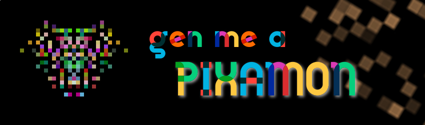

## Generate Random Pixel Creatures

Simple code that generate PNG Pixel Art of Little Monsters.
Perfect for :
- Table-Top RPGs
- Video Games
- Cryptography
- Database Visualisation

**Note :** *I used this to assign each [EAN Barcode](https://en.wikipedia.org/wiki/International_Article_Number) in a database manager a cool low-rez monster.*

### How to use

1. [Download Rust](https://www.rust-lang.org/tools/install)
2. Choose a number between 0 and 2^64 - 1
3. Generate your monster making sure to pass your chosen number in as a commmand line argument.
  Quickstart
  ```bash
  # Where "seed" is an unsigned 64 bit integer
  cargo run seed
  ```
  
  ```bash
  # make an .exe
  cargo build --release
  # run executable where "seed" is an unsigned 64 bit integer
  target/release/gen_me_a_pixamon seed
  ```

### Customise

##### Monster visual complexity
```rust
// Modify this value here to increase the number of pixels that make up a monster.
// We can modify the resolution of the final PNG later.
let size : u32 = 32;
let monster = make_monster(0, size, make_vec(0,0);
asserteq!(monster.get_width(), size);
asserteq!(monster.get_height(), size);
```

##### Monster location
```rust
// Modify this value here to increase the number of pixels that make up a monster.
let location : Vec2 = make_vec(16, 2);
let _monster = make_monster(0, size, make_vec(0,0);
// We can modify the resolution later.
```

    
    

    // resize the monster to a desired resolution(img_size)
    let img_size : u32 = 128;
    let factor : f32 = (img_size as f32) / (size as f32);
    let img : Image = bmp_resize(monster, factor);


### Credits
*In loving memory of [PixelEncounter](https://pixelencounter.com/) by [Josh Gomez](https://github.com/XzaR90/PixelEncounter)*

- Based on the work of [ZzSprite](https://github.com/KilledByAPixel/ZzSprite/blob/master/ZzSprite.js)
- Original alogrithm by [FireFly](https://www.dwitter.net/d/3078)
- Thanks to [Andras](https://github.com/fordosa90) for helping me track down and thank Josh.
